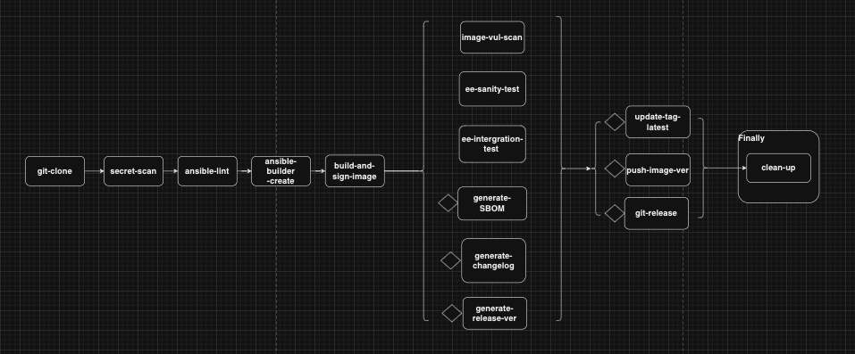

# Ansible Tekton Demo

The goal is to automate the full release cycle of an Ansible Execution Environment,
including code linting, testing and image (EE) build, signing, testing, push to the image registry, semantic release and SBOM generator.

## Tools used in the demo

- pre-commit 3.4.0
- OpenShift 4.13.12
- Ansible
- OpenShift Pipelines 1.12.0
- Semantic Release v22.0.6

## Setup pre-commit

Install [pre-commit](https://pre-commit.com/) on your local (virtual)
machine: `pip3 install pre-commit==<version>`

In your repo path, please run: `pre-commit install`,

If you want to use your own pre-commit config, please do:
`pre-commit install -c <your-config>`

## Setup Pipeline As Code

This demo uses GitHub webhook as an example, but you can refer to
[pipeline as code](https://pipelinesascode.com/) for other configurations.

By default, OpenShift Pipelines enables the pipeline as code.

Following the [instruction](https://pipelinesascode.com/docs/install/github_webhook/)
to configure GitHub webhook for the repo.

After that, create a new namespace for the demo in your cluster and create the resouces
in `.tekton/pac/` in the corresponding namespace with the correct values.

## Tekton Pipelines Architecture

There is one `PipelineRun` (`ansible-ee-pipeline`) located in `.tekton/`.

### Ansible Execusion Environment Pipeline

There is a basic example for a basic [Ansible execution
environment](https://docs.ansible.com/automation-controller/latest/html/userguide/execution_environments.html)
in the `ansible-ee`.
The pipeline consists of the tasks showed below:

After cloning the Git repo, it will do a basic secret scanning, and ansible linting on the
EE manifests. After that, `ansible-builder-create` will create a `Dockerfile`/`Containerfile`
in the defined context directory, subsequently the resulted Dockerfile will be built followed by
a series of test. The SBOM and corresponding release version and changelog will be generated.

In the end, the image will be published to the image registry and the tagged latest image will be
updated, as well as the git release. A final cleanup will be executed.

> **_NOTE:_** we need to create a Kubernetes secret that stores credentials to authenticate against the image
> registry, please check the example secret in `.tekton/pac/registry-credentials.example.yaml`

### Tekton Chains

In addition, [Tekton Chains](https://tekton.dev/docs/chains/) is used for signing artifacts.

We used cosign

`cosign generate-key-pair k8s://ansible-tekton-demo/signing-secrets`

create a secret where stores registry credentials

`oc create secret registry-credentials --from-file=.dockerconfigjson --type=kubernetes.io/dockerconfigjson -n $NAMESPACE`

After that, run the following command to patch the secrets to the defaule pipeline service account:

`oc patch sa pipeline -p "{\"imagePullSecrets\": [{\"name\": \"registry-credentials\"}]}" -n ansible-tekton-demo`

## Set up semantic-release

[semantic-release](https://github.com/semantic-release/semantic-release) is used for automating
the whole package release workflow. If you want to test it locally, please follow the steps:

- [install](https://github.com/semantic-release/semantic-release/blob/4711a381965986ef2e27828c75146261e2cddd6f/docs/usage/installation.md#installation) semantic release
- install the plugins by running `npm clean-install` in the repo path
- configure [authentication](https://github.com/semantic-release/semantic-release/blob/4711a381965986ef2e27828c75146261e2cddd6f/docs/usage/ci-configuration.md#authentication) for semantic-release, in this case, we need `GITHUB_TOKEN`, which one can create in the developer setting from your GitHub account.
- By defining the `release.config.js` in the repo, semantic-release will use it as the configuration for generating/publishing the next release
- You can run `npx semantic-release` or with `--dry-run` flag to start the semantic-release

In this example, semantic-release is included in Tekton pipeline, there are other [CI configuration examples](https://github.com/semantic-release/semantic-release/blob/4711a381965986ef2e27828c75146261e2cddd6f/docs/recipes/ci-configurations/README.md) for setting up semantic-release in your CI environment.

## TBD

- [ ] Implement SBOM
- [ ] Implement integration test
- [ ] Push signature to Quay.io

## Links

- [Tekton results new line issues](https://github.com/tektoncd/pipeline/issues/2936),
    current solution is to do `echo -n "something" | tee $(results.someresult.path)`
