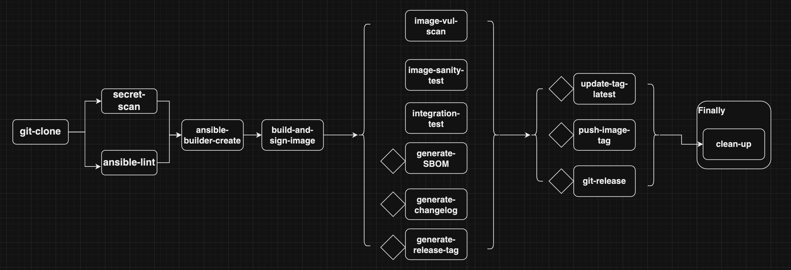

# Ansible Tekton Demo

The goal is to automate the full release cycle of an Ansible Execution Environment,
including code linting, testing and image build, testing, push to the registry
or automation hub, semantic release and SBOM generator.

## Tools used in the demo

- pre-commit 3.4.0
- OpenShift 4.13.12
- Ansible
- OpenShift Pipelines 1.12.0

## Setup pre-commit

Install [pre-commit](https://pre-commit.com/) on your local (virtual)
machine: `pip3 install pre-commit==<version>`

In your repo path, please run: `pre-commit install`,

If you want to use your own pre-commit config, please do:
`pre-commit install -c <your-config>`

## Setup Pipeline As Code

This demo uses GitHub webhook as an example, but you can refer to
[pipeline as code](https://pipelinesascode.com/) for other configurations.

By default, OpenShift Pipelines enables the pipeline as code.

Following the [instruction](https://pipelinesascode.com/docs/install/github_webhook/)
to configure GitHub webhook for the repo.

After that, create a new namespace in your OpenShift cluster and create the resouces
in `.tekton/pac/` in the corresponding namespace with the correct values.

## Tekton Pipelines Architecture

There are two `PipelineRun` in `.tekton/`:

- `ansible-ee-pipeline`
- `ansible-collection-pipeline`

### Ansible Execusion Environment Pipeline

There is a basic example for a basic [Ansible execution
environment](https://docs.ansible.com/automation-controller/latest/html/userguide/execution_environments.html)
in the `examples/ansible-ee`.
The pipeline consists of the tasks showed below:

After cloning the Git repo, it will do a basic secret scanning, and ansible linting on the
EE manifests. After that, `ansible-builder-create` will create a `Dockerfile`/`Containerfile`
in the defined context directory, subsequently the resulted Dockerfile will be built followed by
a series of test. The SBOM and corresponding release version and changelog will be generated.

In the end, the image will be published to the image registry and the tagged latest image will be
updated, as well as the git release. A final cleanup will be executed.

### Tekton Chains

In addition, [Tekton Chains](https://tekton.dev/docs/chains/) is used for signing artifacts.
We used cosign
`cosign generate-key-pair k8s://ansible-tekton-demo/signing-secrets`
create a secret where stores registry credentials
`oc create secret registry-credentials --from-file=.dockerconfigjson --type=kubernetes.io/dockerconfigjson -n $NAMESPACE`
`oc patch sa pipeline -p "{\"imagePullSecrets\": [{\"name\": \"registry-credentials\"}]}" -n ansible-tekton-demo`

### Ansible Collection Pipeline

There is a basic ansible collection example in the `examples/collections`

The pipeline consists of the tasks showed below:

Similar to `ansible-ee-pipeline`, after cloning the Git repo, secret scanning,
and ansible linting on the ansible manifests, a set of tests for the collection
will be executed. The SBOM and corresponding release version and changelog will
be generated.

After the collection passed the test, it will be uploaded to automation
hub or any other desired artifactory registry. It will be published after human approval
Finally, a cleanup will be executed.
